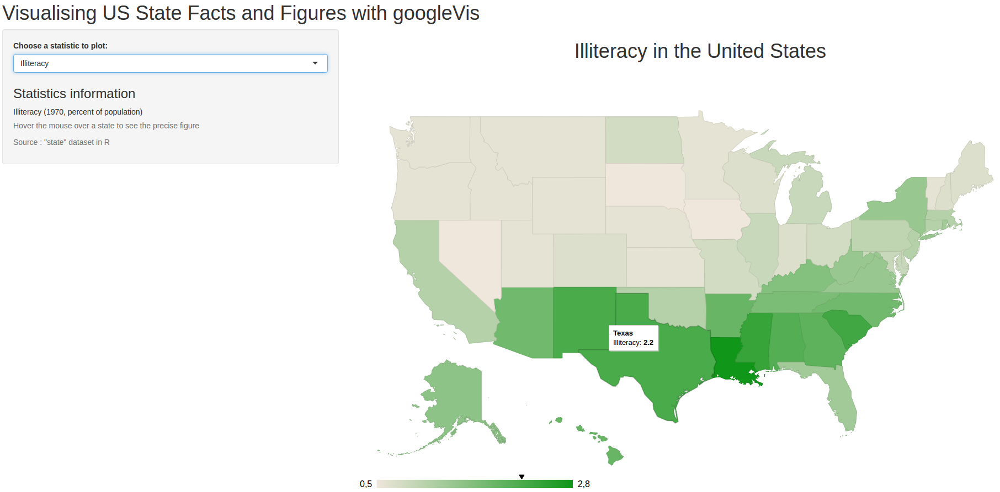

## Presentation

This Shiny app uses the googleVis package to plot different statistics about US states on a map.

The user can choose what information he wants to see.

The data source is the "state" dataset from R.

The app can be found here : https://ssoualem.shinyapps.io/DataProductsShiny/

--- .class #id  

## Available statistics for each state

* Population: Population estimate as of July 1, 1975 (in thousands)

* Income: Per capita income (1974)

* Illiteracy: Illiteracy rate (1970, percent of population)

* Life Expectancy: Life expectancy in years (1969–71)

* Murder rate: Murder and non-negligent manslaughter rate per 100,000 population (1976)

* High-school graduation rate: Percent high-school graduates (1970)

* Number of days below freezing: Mean number of days with minimum temperature below freezing (1931–1960) in capital or large city

* Area: Land area in square miles


--- .class #id  

## Data sample
```{r, echo=FALSE, results=FALSE}
suppressPackageStartupMessages(library(googleVis))
library(datasets)
```

Source data sample
```{r}
data(state)
head(state.x77, 4)
```

--- .class #id  

## Demonstration
```{r, out.width = 920, fig.retina = NULL, echo=FALSE}

```

Some information about the data is available in the sidebar.

The precise figure can be seen by hovering the mouse over a state.
